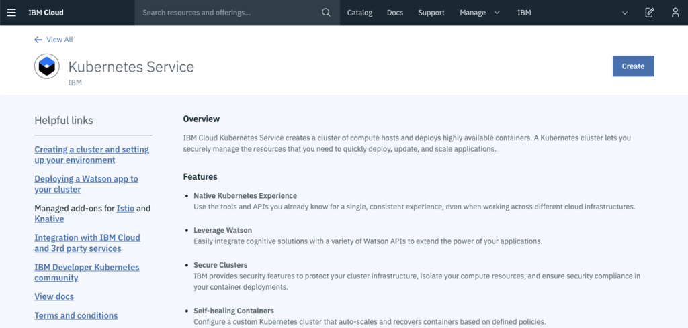
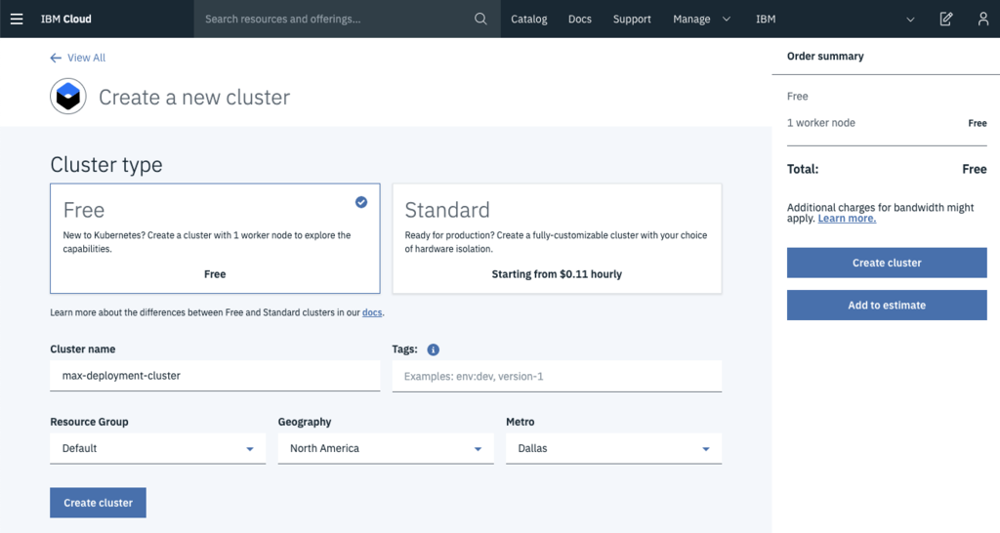
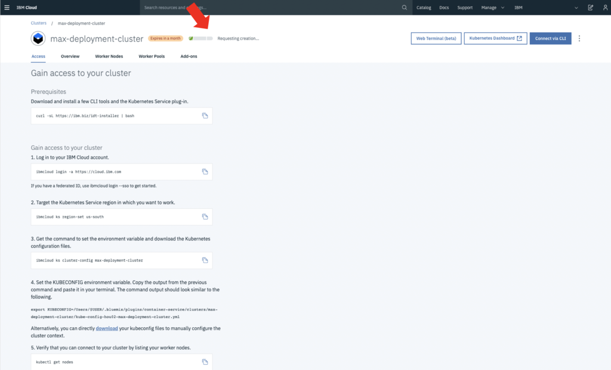
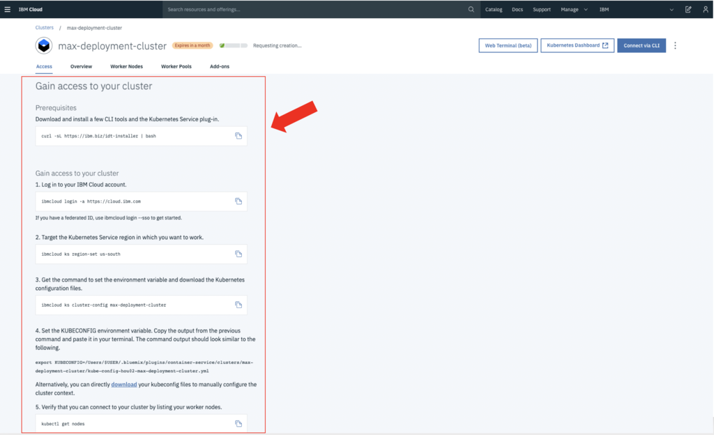
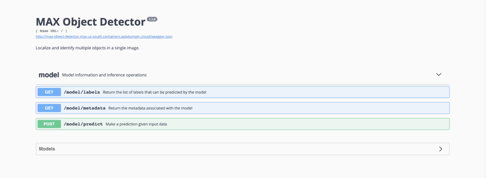

# MAX to IBM Cloud Deployment Tutorial

Looking to deploy a MAX model to IBM Cloud? Smart!
Fortunately, it's not only easy, but also free. 


The entire process comes down to 3 simple steps:
1. Creating an IBM Cloud account
2. Setting up a Kubernetes cluster
3. Deploying the MAX model


In this tutorial, we will use the Kubernetes system to deploy a cloud instance for your MAX model of choice. The Kubernetes service allows us to easily scale the containerized model from supporting a low rate of queries to production-level queries. The free IBM Cloud Kubernetes Service is limited to 1 worker, but this will do fine for this application. Let's get started!

## 1. Creating an IBM Cloud account
If you don't already have one, go to [https://cloud.ibm.com/registration](https://cloud.ibm.com/registration) to sign up for a free IBM Cloud account. The registration process is no different than the usual, so no further explanation is required. Log in to your cloud dashboard when you're done.

## 2. Starting a Kubernetes Cluster

**Create the Kubernetes Service in your IBM Cloud Dashboard**

- Find the [Kubernetes Service](https://cloud.ibm.com/kubernetes/catalog/cluster) in the Cloud Catalog. Click `Create` or `Create Resource` to add the `Kubernetes Service` to your resources. The [Kubernetes Service](https://cloud.ibm.com/kubernetes/catalog/cluster) should look something like this (but is subject to change).



- Select the `Free` cluster type, and specify the cluster name and physical location. In this tutorial, we will name the cluster 'max-deployment-cluster'. When done, click `Create Cluster` to confirm.



- Your Kubernetes Cluster is now being installed on IBM Cloud. You can follow the progress bar at the top of the page (see the red arrow on the picture below). Next, we will go over the instructions detailed on this page to get access to the cluster.



**Install the IBM Cloud CLI and Kubernetes CLI**

In order to be able to communicate effectively with our newly created cluster, we need to install the [IBM Cloud command-line interface (CLI)](https://cloud.ibm.com/docs/cli/reference/ibmcloud?topic=cloud-cli-ibmcloud-cli#ibmcloud-cli). This will allow us to log in to the cloud from our local machine.

Next, we will install the [Kubernetes command-line interface (CLI)](https://kubernetes.io/docs/tasks/tools/install-kubectl/), to have access to the tools needed to manage and deploy to the Kubernetes cluster after logging in to IBM Cloud.

Fortunately, both of these command-line tools can be installed at the same time with one line of code!

- For **Mac and Linux**, run the following command and follow the instructions:

`curl -sL https://ibm.biz/idt-installer | bash`

- For **Windows**, run the following command as administrator and follow the instructions:

`Set-ExecutionPolicy Unrestricted; iex(New-Object Net.WebClient).DownloadString('http://ibm.biz/idt-win-installer')`

*If you are having trouble, or need more information, navigate to the installation instructions [here](https://cloud.ibm.com/docs/cli/reference/ibmcloud?topic=cloud-cli-ibmcloud-cli#ibmcloud-cli) (or search for 'IBM Cloud CLI' on the web).*

**Accessing the Kubernetes Cluster**

Now that we have installed the IBM Cloud communication tools, we are nearly there. However, we still need to log in to IBM Cloud on our local machine, and specify what cluster we are targeting in the cloud. All these instructions are also available under the `Access tab` on the online page of the kubernetes cluster we have just created.



- Log in to the cluster from your local machine

`ibmcloud login -a https://cloud.ibm.com`


- Specify the Kubernetes Service region in which you want to work. Our cluster is in US South.

`ibmcloud ks region-set us-south`


- Get the command to set the environment variable and download the Kubernetes configuration files to the cluster. 
NOTE: Replace the last argument (`max-deployment-cluster`) with the name you gave your cluster earlier.

`ibmcloud ks cluster-config max-deployment-cluster`


- Copy the output from the previous command and paste it in your terminal. The command starts with `export KUBECONFIG=...`. This sets the KUBECONFIG environment variable. 


- Verify that you can connect to your cluster by listing your worker nodes.
kubectl get nodes


We are now ready for the final step of the deployment.

## 3. Deploying the MAX model

The actual deployment process is very short. Now that the connection with the remote Kubernetes cluster has been set up, we merely have to apply the model's configuration file to the Kubernetes cluster to get the API up and running.


Let's download the model's repository, which contains the YAML configuration file.

- Clone the MAX-Model repository from GitHub. This example shows how to do this for the MAX-Object-Detector, but feel free to replace `MAX-Object-Detector` with your MAX Model of choice.

`git clone https://github.com/IBM/MAX-Object-Detector.git`

- Find the YAML file in the downloaded directory.

`cd MAX-Object-Detector`
`ls *.yaml`

- Apply the configuration file to our Kubernetes cluster. Again, replace the `max-object-detector.yaml` with the `.yaml` file for your model. This command deploys the model.

`kubectl apply -f ./max-object-detector.yaml`

- When the model is deployed (give it some time), find the public IP address and port that the API is served on.
    - The public IP
    
    `ibmcloud cs workers mycluster`
    
    - The port
    
    `kubectl describe service max-text-sentiment-classifier | grep NodePort`
 
 - Navigate to the http://<PUBLIC_IP>:<PORT> address in your browser. You should find the API frontend as shown below.
 

 
The MAX model is now permanently available. Done!

**Some useful commands**

Kubernetes CLI:
 ```
# Show the log of all events
kubectl get events

# Show all pods
kubectl get pods

# Show all services
kubectl get services

# Show all deployments
kubectl get deployments

# Show the details of a service
kubectl describe service SERVICE_NAME

# Show the details of a node
kubectl describe node NODE_NAME

# Delete a service
kubectl delete services SERVICE_NAME

# Delete a deployment
kubectl delete deployment DEPLOYMENT_NAME

# Debugging a pod
kubectl logs POD_NAME
```

IBM Cloud CLI:
```
# Show all clusters
ibmcloud cs clusters

# Show the workers of a specific cluster
ibmcloud cs workers CLUSTER_NAME
```

**Further scaling**

Scaling an application with Kubernetes is nothing more than clicking a button. Adding worker nodes (computation units) or specifying advanced cluster parameters (e.g. more RAM) can easily be done from the Cloud Dashboard. However, you'll have to upgrade to a standard cluster in order to access these. With more worker nodes, a single node's public IP address does not suffice, so services like [Ingress](https://kubernetes.io/docs/concepts/services-networking/ingress/) and [Loadbalancer](https://kubernetes.io/docs/concepts/services-networking/ingress/) will need to be added as well.

## Troubleshooting

An easy way to detect general issues with your Kubernetes cluster is to visit the Kubernetes Dashboard on IBM Cloud. Any critical or pending worker nodes will be highlighted. In addition, you can run the following commands in the terminal.

- Check Kubernetes events

`kubectl get events`

- Get the logs for a pod

`kubectl logs POD_NAME`

**Memory issues and killed containers**

When trying to deploy a model with above-average memory requirements (for example the MAX-Image-Resolution-Enhancer), you will run into a 'TypeError: Failed to fetch' error. Although the frontend is still responsive, this error often means that the container was killed and restarted due to exceeding the memory limit after posting an input image. In this case, you will need to upgrade to a standard Kubernetes cluster in order to choose the specifications of the worker nodes. Increasing the resources of the node solves this issue.