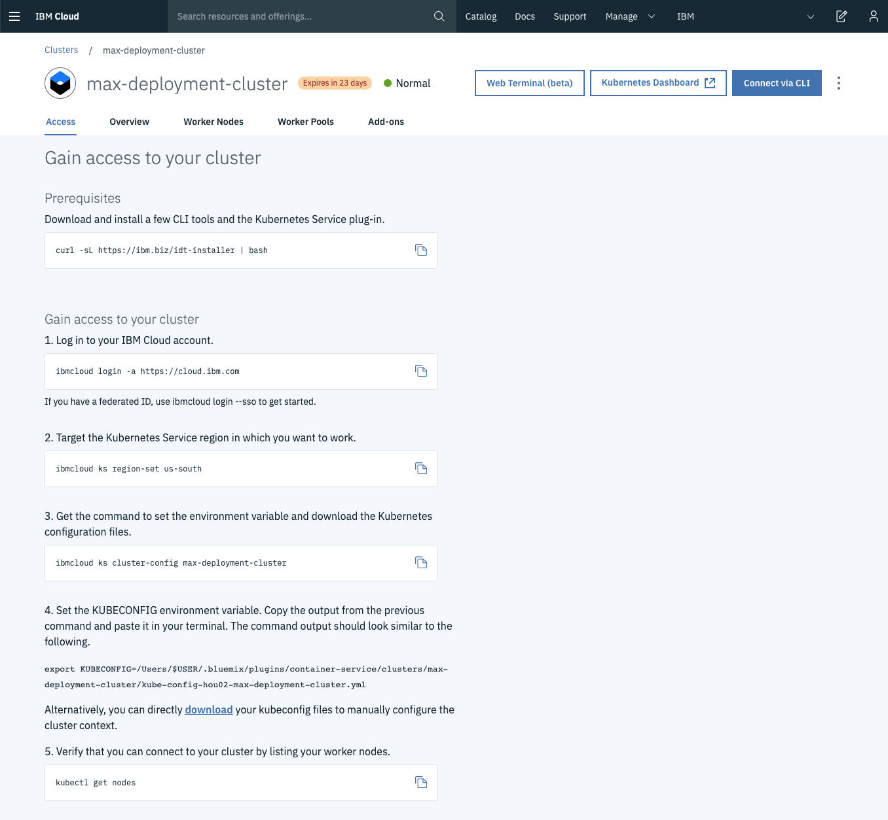
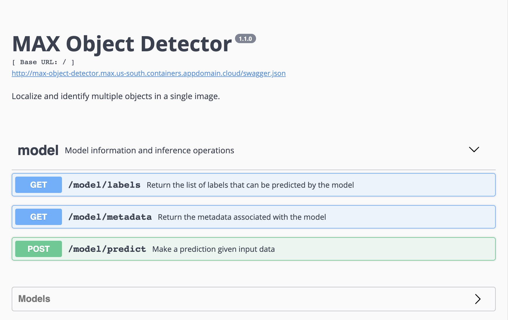

## Learning objective

In this tutorial, we will use the Kubernetes system to deploy a cloud instance for your MAX model of choice. The Kubernetes service allows us to easily scale the containerized model from supporting a low rate of queries to production-level queries. The free IBM Cloud Kubernetes Service is limited to 1 worker, but this will do fine for this application. Let's get started!

## Prerequisites

If you are not familiar with the Model Asset Exchange, this [introductory article](https://developer.ibm.com/articles/introduction-to-the-model-asset-exchange-on-ibm-developer/) provides a good overview.

Additionally, you will need the following:

1. An IBM Cloud account. You can sign up [here](http://ibm.biz/CloudSignup) for a free account.
2. An available Kubernetes cluster on your IBM Cloud account. The **free** cluster type will suffice. Create a Kubernetes cluster from the IBM Cloud catalog [here](https://cloud.ibm.com/kubernetes/catalog/cluster).
3. The IBM Cloud command-line interface (CLI) installed. After creating a Cloud account and a Kubernetes cluster, we will need to communicate with the cluster using our local machine. Installation instructions are available [here](https://cloud.ibm.com/docs/cli/reference/ibmcloud?topic=cloud-cli-ibmcloud-cli#ibmcloud-cli) (or by searching for 'IBM Cloud CLI' on the web).

## Estimated time

With the prerequisites available, it should take you approximately 20 minutes to complete this tutorial.

## Steps

This tutorial consists of the following steps:

* [Accessing the Kubernetes cluster](#1-accessing-the-kubernetes-cluster)
* [Deploying the MAX model](#2-deploying-the-max-model)


### 1. Accessing the Kubernetes cluster

With an IBM Cloud account available, a Kubernetes cluster created, and the Cloud CLI installed (see [Prerequisites](#prerequisites)), the actual deployment step itself is the easiest part. Let's begin by establishing the connection between our local machine and our Kubernetes cluster.


First, we will use the command-line interface (CLI) to log in to IBM Cloud on our local machine and specify what cluster we are targeting in the cloud. All these instructions are also available under the **Access tab** on the online page of your kubernetes cluster. Please visit this **Access tab** to ensure you are working with the most up-to-date instructions.



Let's execute the instructions.

- Log in to the cluster from your local machine

    ```
    ibmcloud login -a https://cloud.ibm.com
    ```


- Set the IBM Cloud region to the Kubernetes Service region you have selected when creating your cluster. Our cluster is in US South, but information on other regions can be found [here](https://cloud.ibm.com/docs/containers?topic=containers-regions-and-zones). 

    ```
    ibmcloud ks region-set us-south
    ```


- Get the command to set the environment variable and download the Kubernetes configuration files to the cluster. 
NOTE: Replace the last argument (`max-deployment-cluster`) with the name you gave your Kubernetes cluster.

    ```
    ibmcloud ks cluster-config max-deployment-cluster
    ```


- Copy the output from the previous command and paste it in your terminal. The command starts with ```export KUBECONFIG=...```. This command needs to be executed because it exports the required ```KUBECONFIG``` environment variable. 


- Verify that you can connect to your cluster by listing your worker nodes. The `kubectl` commands are part of the Kubernetes CLI, which was installed in the same process as the IBM Cloud CLI. If the `kubectl` command returns `command not found`, you will have to install the kubernetes CLI separately. Instructions can be found on the [official page](https://kubernetes.io/docs/tasks/tools/install-kubectl/) or on the [IBM Cloud CLI page](https://cloud.ibm.com/docs/containers?topic=containers-cs_cli_install#cs_cli_install_steps).

  ```
  kubectl get nodes
  ```


We are now ready for the final step of the deployment.

### 2. Deploying the MAX model

The actual deployment process is very short. Now that the connection with the remote Kubernetes cluster has been set up, we merely have to apply the model's configuration file to the Kubernetes cluster to get the API up and running.


Let's download the model's repository, which contains the YAML configuration file.

- Clone the MAX-Model repository from GitHub. This example shows how to do this for the MAX-Object-Detector, but feel free to replace ```MAX-Object-Detector``` with your MAX Model of choice.

    ```
    git clone https://github.com/IBM/MAX-Object-Detector.git
    ```

- Find the YAML file in the downloaded directory.

    ```
    cd MAX-Object-Detector

    ls *.yaml
    ```

- Apply the configuration file to our Kubernetes cluster. Again, replace the ```max-object-detector.yaml``` with the ```.yaml``` file corresponding to your model. This command deploys the model.

    ```
    kubectl apply -f ./max-object-detector.yaml
    ```

- When the model is deployed (give it some time), find the public IP address and port that the API is served on.
    - The public IP
    
      ```
      ibmcloud cs workers mycluster
      ```
    
    - The port
    
        ```
        kubectl describe service max-text-sentiment-classifier | grep NodePort
        ```
 
 - Navigate to the ```http://<PUBLIC_IP>:<PORT>``` address in your browser. You should find the API frontend as shown below.
 
    
 
The MAX model is now permanently available. Congratulations!

**Some useful commands**

Kubernetes CLI:
    
  ```
  # Show the log of all events
  kubectl get events
  
  # Show all pods
  kubectl get pods
  
  # Show all services
  kubectl get services
  
  # Show all deployments
  kubectl get deployments
  
  # Show the details of a service
  kubectl describe service SERVICE_NAME
  
  # Show the details of a node
  kubectl describe node NODE_NAME
  
  # Delete a service
  kubectl delete services SERVICE_NAME
  
  # Delete a deployment
  kubectl delete deployment DEPLOYMENT_NAME
  
  # Debugging a pod
  kubectl logs POD_NAME
  ```

IBM Cloud CLI:

  ```
  # Show all clusters
  ibmcloud cs clusters
  
  # Show the workers of a specific cluster
  ibmcloud cs workers CLUSTER_NAME
  ```

**Further scaling**

Scaling an application with Kubernetes is nothing more than clicking a button. Adding worker nodes (computation units) or specifying advanced cluster parameters (e.g. more RAM) can easily be done from the Cloud Dashboard. However, you'll have to upgrade to a standard cluster in order to access these. With more worker nodes, a single node's public IP address does not suffice, so services like [Ingress](https://kubernetes.io/docs/concepts/services-networking/ingress/) and [Loadbalancer](https://kubernetes.io/docs/concepts/services-networking/ingress/) will need to be added as well.

### Troubleshooting

An easy way to detect general issues with your Kubernetes cluster is to visit the Kubernetes Dashboard on IBM Cloud. Any critical or pending worker nodes will be highlighted. In addition, you can run the following commands in the terminal.

- Check Kubernetes events

  ```
  kubectl get events
  ```

- Get the logs for a pod

  ```
  kubectl logs POD_NAME
  ```


**Memory issues and killed containers**

When trying to deploy a model with above-average memory requirements (for example the MAX-Image-Resolution-Enhancer), you will run into a 'TypeError: Failed to fetch' error. Although the frontend is still responsive, this error often means that the container was killed and restarted due to exceeding the memory limit after posting an input image. In this case, you will need to upgrade to a standard Kubernetes cluster in order to choose the specifications of the worker nodes. Increasing the resources of the node solves this issue.


## Summary

This tutorial illustrates how to deploy a model container from the Model Asset Exchange to IBM Cloud using Kubernetes. The two steps followed are:

* [Accessing the Kubernetes cluster](#1-accessing-the-kubernetes-cluster)
* [Deploying the MAX model](#2-deploying-the-max-model)
